## Fanpokka 系統架構分析

### 🏗️ 整體架構概覽

Fanpokka 是一個基於現代 Laravel 生態系統構建的寵物養成遊戲平台，採用了多層架構設計，結合了傳統 MVC 模式和現代化的前端互動技術。

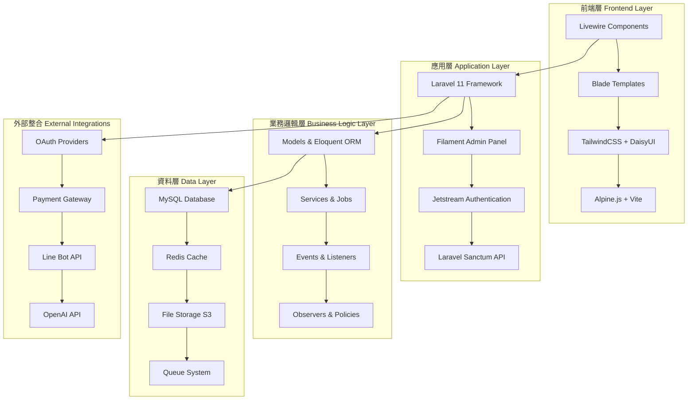

### 🛠️ 技術堆疊詳細分析

#### **後端核心技術**
- **Laravel 11**: 最新版本的 PHP 框架，提供強大的基礎功能
- **PHP 8.2+**: 現代化的 PHP 版本，支援最新語言特性
- **Livewire 3.0**: 全棧框架，實現動態 UI 而無需編寫 JavaScript
- **Filament 3.2**: 現代化的 Laravel 管理面板框架

#### **認證與授權系統**
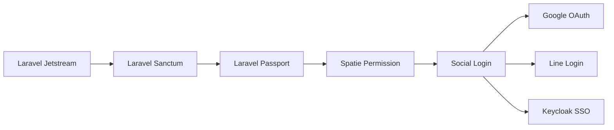

- **Laravel Jetstream**: 提供完整的認證腳手架
- **Laravel Sanctum**: API 令牌認證
- **Laravel Passport**: OAuth2 伺服器實作
- **Spatie Permission**: 角色權限管理
- **Social Login**: 支援 Google、Line、Keycloak 等第三方登入

#### **前端技術架構**
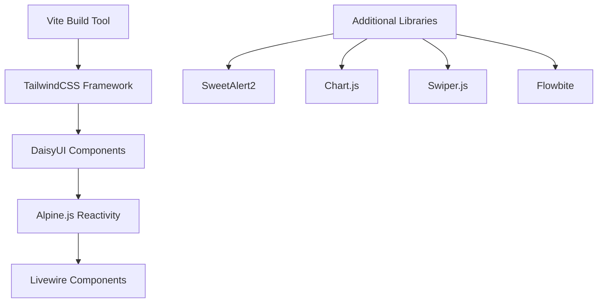

- **Vite**: 現代化的前端建構工具
- **TailwindCSS**: 實用優先的 CSS 框架
- **DaisyUI**: TailwindCSS 的組件庫
- **Alpine.js**: 輕量級的 JavaScript 框架
- **Chart.js**: 圖表視覺化庫

#### **資料庫與快取架構**
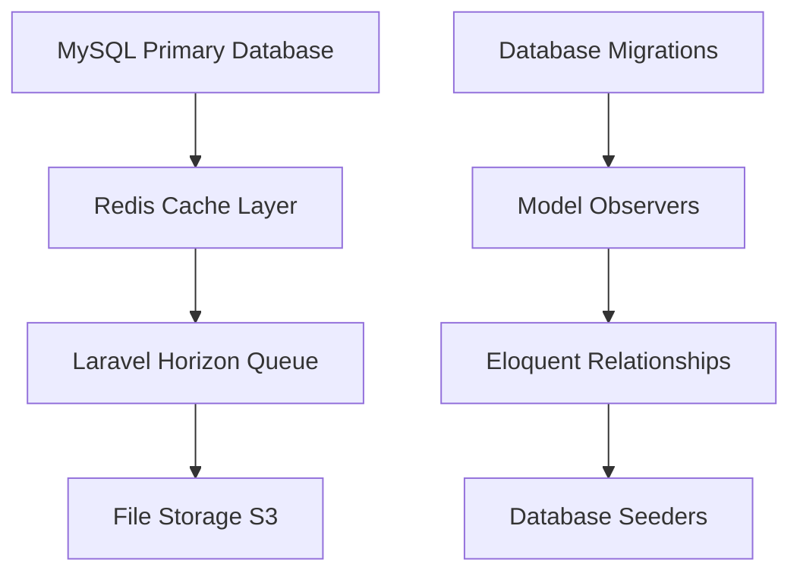

- **MySQL**: 主要資料庫系統
- **Redis**: 快取和會話存儲
- **Laravel Horizon**: 佇列監控和管理
- **AWS S3**: 檔案存儲服務

#### **核心業務模組架構**


### 🔧 系統整合與服務

#### **第三方服務整合**
- **OpenAI API**: AI 功能整合
- **Pusher**: 即時通訊服務
- **Line Bot API**: Line 官方帳號整合
- **精誠金融 API**: 支付閘道整合
- **Google/Line OAuth**: 社交登入

#### **監控與分析**
- **Laravel Pulse**: 應用程式效能監控
- **Laravel Horizon**: 佇列作業監控
- **Pan Analytics**: 自定義分析系統
- **Operation Logs**: 操作日誌記錄

### 📊 架構優勢分析

#### **技術優勢**
1. **現代化技術堆疊**: 使用最新版本的 Laravel 和相關套件
2. **全棧整合**: Livewire 提供無縫的前後端整合
3. **模組化設計**: 清晰的模組分離和職責劃分
4. **擴展性**: 支援水平和垂直擴展

#### **開發效率**
1. **快速開發**: Filament 管理面板大幅提升後台開發效率
2. **代碼重用**: 豐富的 Trait 和 Service 類別
3. **自動化**: 完整的 Observer 和 Event 系統
4. **測試友好**: 內建 Pest 測試框架

#### **維護性**
1. **清晰的架構**: MVC + Service Layer 架構
2. **完整的日誌**: 操作日誌和錯誤追蹤
3. **版本控制**: 資料庫遷移和版本管理
4. **文檔化**: 豐富的註釋和文檔

### 🚀 部署與運維

#### **部署架構**
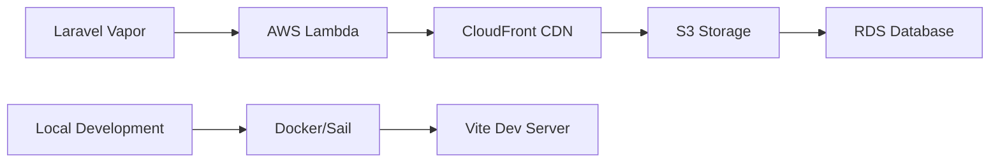

- **Laravel Vapor**: 無伺服器部署平台
- **AWS 生態系統**: 完整的雲端服務整合
- **Docker/Sail**: 本地開發環境


---

# Fanpokka 架構改進建議分析

基於對 Fanpokka 寵物養成遊戲系統的深入分析，我提出以下架構改進建議：

## 🚀 效能優化建議

### 1. 快取策略改進
**現狀問題**：
- 預設使用 database 快取驅動，效能較差
- 缺乏分層快取策略

**改進建議**：
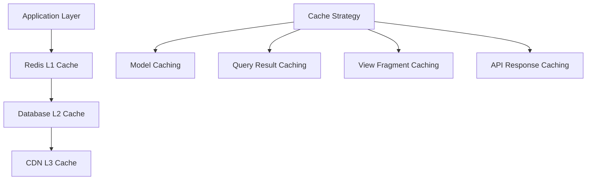

**具體實作**：
- 將快取驅動改為 Redis
- 實作模型快取層（Pet、Mission、Product）
- 加入 Livewire 組件快取
- 實作 API 響應快取機制

### 2. 資料庫優化
**現狀問題**：
- 缺乏讀寫分離
- 索引策略可能不完整
- 大量關聯查詢可能造成 N+1 問題

**改進建議**：
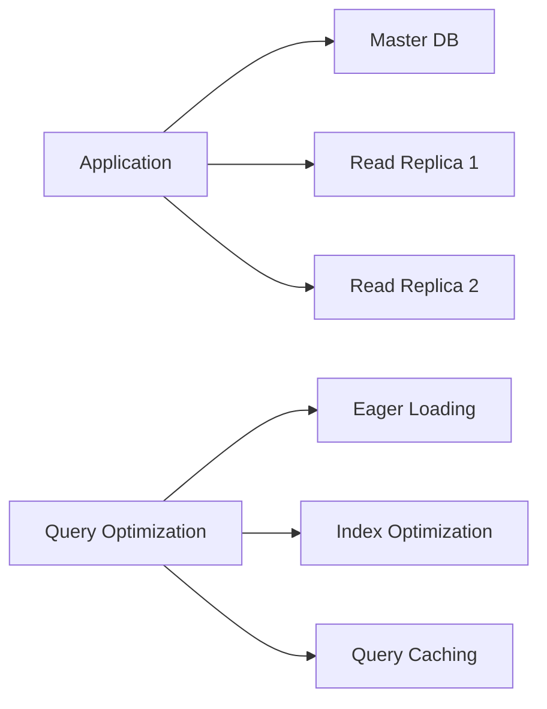

**具體實作**：
- 設定 MySQL 讀寫分離
- 優化關鍵查詢的索引
- 實作 Eloquent 關係的 Eager Loading
- 加入資料庫查詢監控

### 3. 佇列系統優化
**現狀問題**：
- 使用 database 佇列驅動，效能限制
- 缺乏佇列優先級管理

**改進建議**：
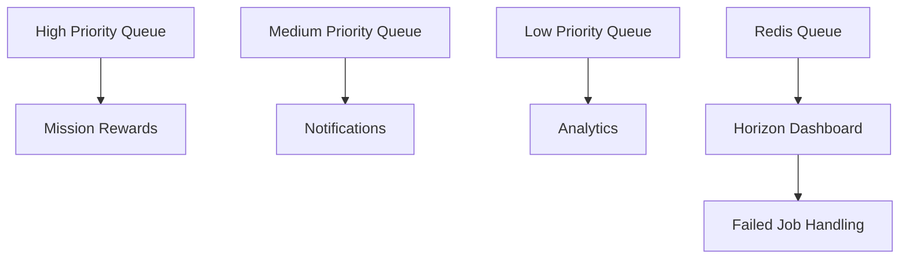

## 🏗️ 架構模式改進

### 1. 領域驅動設計 (DDD) 導入
**現狀問題**：
- 業務邏輯分散在 Model 和 Controller 中
- 缺乏清晰的領域邊界

**改進建議**：
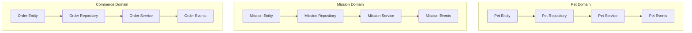

### 2. CQRS 模式實作
**改進建議**：
- 分離命令（寫入）和查詢（讀取）操作
- 為複雜查詢建立專用的讀取模型
- 實作事件溯源機制

### 3. 微服務架構考量
**長期規劃**：
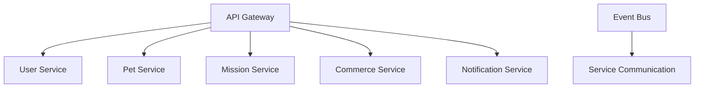

## 🔒 安全性強化

### 1. API 安全改進
**現狀問題**：
- 缺乏 API 速率限制
- 需要加強 CSRF 保護

**改進建議**：
- 實作 API 速率限制中介軟體
- 加入 API 版本控制
- 強化 JWT 令牌管理
- 實作 API 請求簽名驗證

### 2. 資料保護
**改進建議**：
- 敏感資料加密存儲
- 實作資料遮罩機制
- 加入審計日誌
- GDPR 合規性考量

## 📊 監控與可觀測性

### 1. 應用程式監控
**改進建議**：
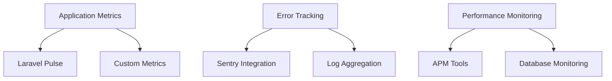

### 2. 業務指標監控
**建議實作**：
- 用戶活躍度追蹤
- 遊戲進度分析
- 收益指標監控
- 系統健康度儀表板

## 🧪 測試策略改進

### 1. 測試覆蓋率提升
**現狀問題**：
- 缺乏完整的測試套件
- 需要加強整合測試

**改進建議**：
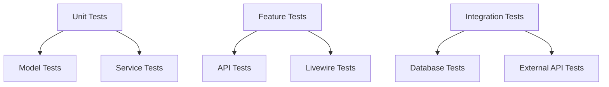

### 2. 自動化測試流程
**建議實作**：
- CI/CD 管道整合
- 自動化效能測試
- 安全漏洞掃描
- 程式碼品質檢查

## 🔄 部署與 DevOps 改進

### 1. 容器化部署
**改進建議**：
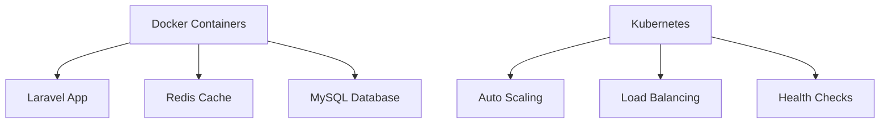

### 2. 藍綠部署策略
**建議實作**：
- 零停機部署
- 自動回滾機制
- 金絲雀發布
- 功能開關管理

## 📈 擴展性規劃

### 1. 水平擴展準備
**改進建議**：
- 無狀態應用設計
- 分散式會話管理
- 負載均衡策略
- 資料庫分片準備

### 2. 國際化支援
**建議實作**：
- 多語言內容管理
- 時區處理優化
- 貨幣本地化
- 文化適應性設計

## 🎯 實施優先級

### 高優先級（立即實施）
1. Redis 快取驅動切換
2. 資料庫索引優化
3. API 速率限制
4. 基礎監控設置

### 中優先級（3-6個月）
1. CQRS 模式導入
2. 測試覆蓋率提升
3. 容器化部署
4. 效能監控強化

### 低優先級（長期規劃）
1. 微服務架構遷移
2. 事件溯源實作
3. 國際化完整支援
4. 高級分析功能

這些改進建議將顯著提升 Fanpokka 系統的效能、可維護性、安全性和擴展性，為未來的業務增長奠定堅實的技術基礎。

---

# Fanpokka 架構對粉絲管理功能的適用性評估

基於對 Fanpokka 現有架構的深入分析，我來評估其作為粉絲管理系統的適用性：

## 🎯 架構適用性總體評估

### ✅ 高度適用的現有功能

#### 1. 用戶管理系統
**現有優勢**：
- 完整的用戶認證體系（Jetstream + Sanctum）
- 多元化登入方式（Google、Line、Keycloak）
- 用戶分級和權限管理（Spatie Permission）
- 用戶資料完整性（個人資料、頭像、經驗值）

**粉絲管理適用性**：⭐⭐⭐⭐⭐
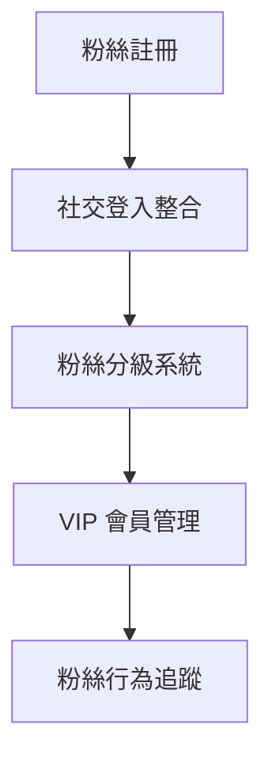

#### 2. 內容管理系統
**現有優勢**：
- 靈活的內容類型系統（Content + ContentType）
- 多媒體內容支援（圖片、影片）
- 內容發布排程
- Zone 分區管理

**粉絲管理適用性**：⭐⭐⭐⭐⭐
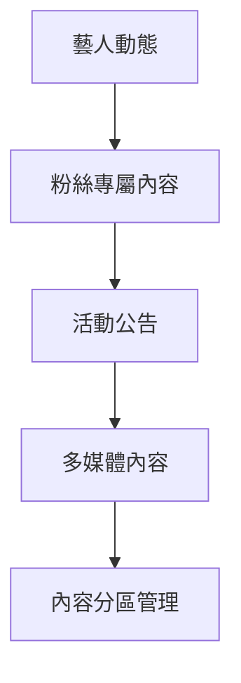

#### 3. 互動系統
**現有優勢**：
- 任務系統可改為粉絲活動
- 投票系統（Poll）
- 訊息系統
- 通知機制

**粉絲管理適用性**：⭐⭐⭐⭐
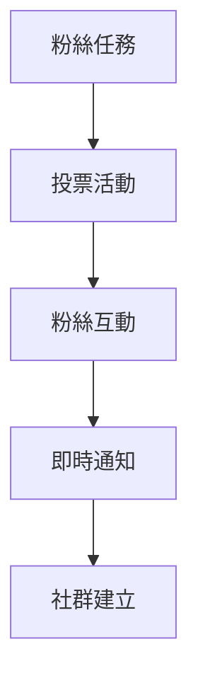

#### 4. 商城與獎勵系統
**現有優勢**：
- 完整的電商功能
- V幣積分系統
- 抽獎機制
- 訂單管理

**粉絲管理適用性**：⭐⭐⭐⭐⭐
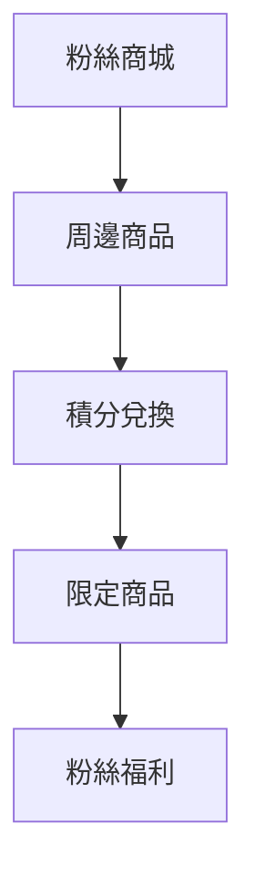

### ⚠️ 需要調整的功能模組

#### 1. 寵物系統 → 粉絲等級系統
**現有結構**：
```php
// Pet Model 可改造為 FanLevel
class Pet {
    protected $fillable = [
        'user_id',
        'animal_id',    // → fan_tier_id
        'level',        // → fan_level
        'name',         // → fan_nickname
        'current_exp',  // → fan_points
    ];
}
```

**改造建議**：
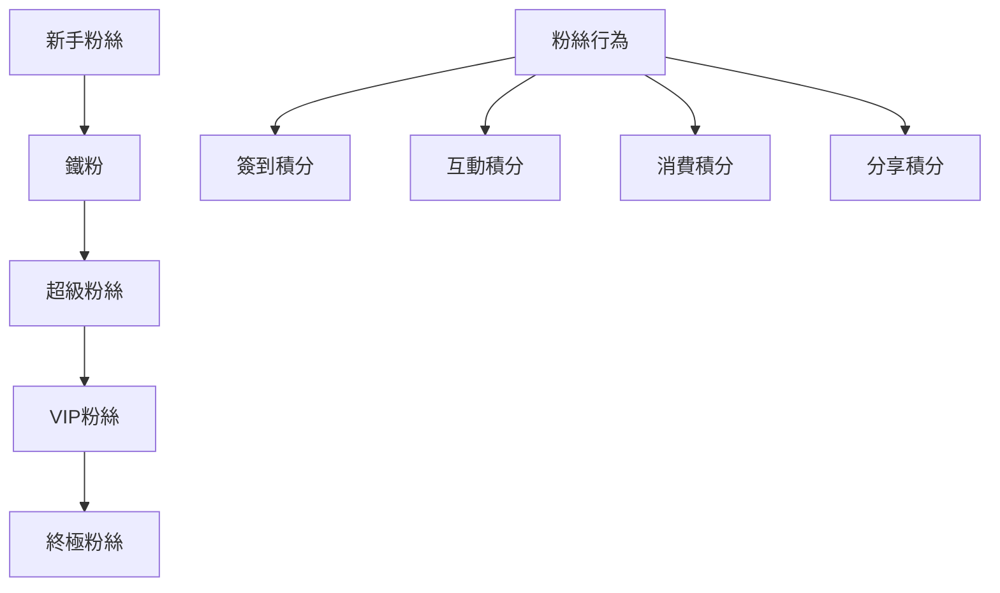

#### 2. 任務系統 → 粉絲活動系統
**現有優勢**：
- 任務創建和管理
- 獎勵分發機制
- 完成狀態追蹤

**改造方向**：
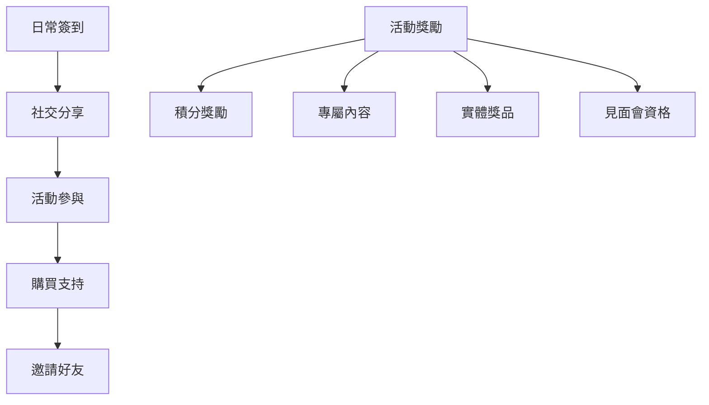

### 🔧 需要新增的核心功能

#### 1. 藝人/明星管理模組
**新增需求**：
```php
// 新增 Celebrity Model
class Celebrity extends Model {
    protected $fillable = [
        'name',
        'stage_name',
        'bio',
        'avatar',
        'social_links',
        'debut_date',
        'status'
    ];
}

// 粉絲關注關係
class FanFollowing extends Model {
    protected $fillable = [
        'user_id',
        'celebrity_id',
        'followed_at',
        'notification_enabled'
    ];
}
```

#### 2. 粉絲社群功能
**建議架構**：
```mermaid
graph TB
    A[粉絲群組] --> B[討論區]
    B --> C[粉絲創作]
    C --> D[活動組織]
    D --> E[線下聚會]
    
    F[社群管理] --> G[版主系統]
    F --> H[內容審核]
    F --> I[舉報機制]
```

#### 3. 數據分析儀表板
**粉絲管理專用指標**：
```mermaid
graph TB
    A[粉絲增長趨勢] --> B[活躍度分析]
    B --> C[互動熱度]
    C --> D[消費行為]
    D --> E[地域分布]
    
    F[藝人表現] --> G[內容熱度]
    F --> H[粉絲反饋]
    F --> I[商業價值]
```

## 📊 技術架構適用性評分

| 功能模組 | 現有適用性 | 改造難度 | 推薦指數 |
|---------|-----------|---------|----------|
| 用戶管理 | ⭐⭐⭐⭐⭐ | 🟢 低 | ⭐⭐⭐⭐⭐ |
| 內容管理 | ⭐⭐⭐⭐⭐ | 🟢 低 | ⭐⭐⭐⭐⭐ |
| 互動系統 | ⭐⭐⭐⭐ | 🟡 中 | ⭐⭐⭐⭐ |
| 商城系統 | ⭐⭐⭐⭐⭐ | 🟢 低 | ⭐⭐⭐⭐⭐ |
| 通知系統 | ⭐⭐⭐⭐ | 🟡 中 | ⭐⭐⭐⭐ |
| 數據分析 | ⭐⭐⭐ | 🔴 高 | ⭐⭐⭐⭐ |
| 社群功能 | ⭐⭐ | 🔴 高 | ⭐⭐⭐⭐⭐ |

## 🚀 改造實施建議

### 階段一：核心功能改造（1-2個月）
1. **用戶系統擴展**
   - 新增粉絲屬性欄位
   - 實作粉絲等級系統
   - 整合社交媒體資料

2. **內容系統調整**
   - 新增藝人內容類型
   - 實作粉絲專屬內容
   - 優化內容推薦算法

### 階段二：互動功能強化（2-3個月）
1. **社群功能開發**
   - 粉絲群組系統
   - 討論區功能
   - 粉絲創作平台

2. **活動系統升級**
   - 線上活動管理
   - 線下活動整合
   - 活動報名系統

### 階段三：高級功能實作（3-4個月）
1. **數據分析平台**
   - 粉絲行為分析
   - 商業價值評估
   - 趨勢預測功能

2. **AI 智能功能**
   - 內容個人化推薦
   - 粉絲情感分析
   - 自動化客服

## 💡 總結評估

**適用性評分：⭐⭐⭐⭐ (4/5)**

**優勢**：
- 現有架構具備 80% 粉絲管理所需功能
- Laravel + Livewire 技術棧非常適合快速開發
- 完整的用戶和內容管理基礎
- 成熟的電商和積分系統

**挑戰**：
- 需要重新設計部分業務邏輯
- 社群功能需要從零開發
- 數據分析功能需要大幅擴展

**結論**：
Fanpokka 的現有架構非常適合改造為粉絲管理系統。其完整的技術基礎設施、靈活的內容管理系統，以及成熟的用戶互動機制，為粉絲管理提供了堅實的技術基礎。主要的改造工作集中在業務邏輯調整和新功能開發上，技術風險相對較低。

**推薦指數：⭐⭐⭐⭐⭐**
這是一個非常可行且具有高成功率的改造方案。

---
# 粉絲管理功能實作策略：微服務 vs 單體架構改進

基於 Fanpokka 現有架構和您的需求，我來分析兩種實作方式的優劣：

## 🏗️ 架構選擇分析

### 方案一：單體架構內改進 (Monolithic Enhancement)

#### ✅ 優勢分析

**1. 開發效率高**
```mermaid
graph TB
    A[現有 Laravel 架構] --> B[直接擴展 Models]
    B --> C[新增 Controllers]
    C --> D[擴展 Livewire 組件]
    D --> E[快速上線]
    
    F[開發時程] --> G[2-3個月完成核心功能]
    F --> H[1個月完成基礎改造]
```

**2. 技術一致性**
- 使用相同的技術棧（Laravel + Livewire）
- 共享現有的認證、授權系統
- 統一的資料庫管理
- 一致的部署流程

**3. 資源共享效率**
```php
// 現有用戶系統直接擴展
class User extends Authenticatable {
    // 新增粉絲相關屬性
    protected $fillable = [
        'fan_level',
        'fan_points',
        'celebrity_following',
        'fan_tier'
    ];
}

// 現有內容系統擴展
class Content extends Model {
    // 新增粉絲內容類型
    const TYPE_FAN_EXCLUSIVE = 'fan_exclusive';
    const TYPE_CELEBRITY_UPDATE = 'celebrity_update';
}
```

**4. 成本控制**
- 無需額外的基礎設施
- 維護成本低
- 部署複雜度低

#### ⚠️ 劣勢分析

**1. 系統複雜度增加**
- 業務邏輯混合
- 代碼耦合度提高
- 測試複雜度增加

**2. 擴展性限制**
- 單點故障風險
- 難以獨立擴展特定功能
- 技術選型受限

### 方案二：微服務架構 (Microservices Architecture)

#### ✅ 優勢分析

**1. 系統解耦**
```mermaid
graph TB
    subgraph "Core Fanpokka"
        A[用戶服務] --> B[內容服務]
        B --> C[商城服務]
    end
    
    subgraph "粉絲管理微服務"
        D[粉絲關係服務] --> E[社群服務]
        E --> F[活動服務]
        F --> G[數據分析服務]
    end
    
    H[API Gateway] --> A
    H --> D
    
    I[Event Bus] --> J[服務間通訊]
```

**2. 技術靈活性**
```yaml
# 微服務技術選型
fan-relationship-service:
  framework: Laravel
  database: MySQL
  
social-community-service:
  framework: Node.js
  database: MongoDB
  
analytics-service:
  framework: Python/Django
  database: ClickHouse
  
real-time-service:
  framework: Go
  database: Redis
```

**3. 獨立擴展**
- 各服務可獨立部署
- 按需擴展資源
- 故障隔離

#### ⚠️ 劣勢分析

**1. 複雜度大幅增加**
```mermaid
graph TB
    A[服務發現] --> B[負載均衡]
    B --> C[API Gateway]
    C --> D[分散式追蹤]
    D --> E[配置管理]
    E --> F[監控告警]
    
    G[開發複雜度] --> H[部署複雜度]
    H --> I[維護複雜度]
```

**2. 資源需求**
- 需要額外的基礎設施
- DevOps 能力要求高
- 開發和維護成本增加

## 🎯 推薦方案：混合式架構

基於您的實際情況，我推薦採用**漸進式微服務架構**：

### 階段一：單體架構擴展（立即實施）
```mermaid
graph TB
    subgraph "Fanpokka Core (Monolithic)"
        A[用戶管理] --> B[內容管理]
        B --> C[商城系統]
        C --> D[基礎粉絲功能]
        D --> E[粉絲等級系統]
        E --> F[粉絲活動]
    end
    
    G[快速實現] --> H[2-3個月上線]
    I[低風險] --> J[技術棧一致]
```

**實作重點**：
1. 在現有 Models 基礎上擴展粉絲功能
2. 新增粉絲專用的 Livewire 組件
3. 擴展現有的通知和任務系統
4. 利用現有的商城系統做粉絲商品

### 階段二：關鍵服務微服務化（6個月後）
```mermaid
graph TB
    subgraph "Fanpokka Core"
        A[用戶管理] --> B[內容管理]
        B --> C[商城系統]
    end
    
    subgraph "微服務"
        D[社群服務] --> E[即時聊天]
        F[數據分析服務] --> G[AI推薦]
        H[通知服務] --> I[多渠道推送]
    end
    
    J[API Gateway] --> A
    J --> D
    J --> F
    J --> H
```

**微服務化優先級**：
1. **社群服務**（高併發需求）
2. **數據分析服務**（計算密集）
3. **通知服務**（多渠道整合）
4. **即時通訊服務**（技術特殊性）

## 📋 具體實施計劃

### 第一階段：單體擴展（1-3個月）

**月份 1：基礎功能**
```php
// 新增粉絲相關 Models
class Celebrity extends Model { /* 藝人管理 */ }
class FanLevel extends Model { /* 粉絲等級 */ }
class FanActivity extends Model { /* 粉絲活動 */ }
class FanCommunity extends Model { /* 粉絲社群 */ }
```

**月份 2-3：核心功能**
- 粉絲關注系統
- 粉絲等級升級機制
- 粉絲專屬內容
- 基礎社群功能

### 第二階段：微服務準備（4-6個月）

**技術準備**：
```yaml
# docker-compose.yml 準備
version: '3.8'
services:
  fanpokka-core:
    build: .
    ports: ["8000:8000"]
    
  fan-community-service:
    build: ./services/community
    ports: ["8001:8000"]
    
  analytics-service:
    build: ./services/analytics
    ports: ["8002:8000"]
    
  api-gateway:
    image: nginx
    ports: ["80:80"]
```

**數據同步策略**：
```mermaid
graph TB
    A[Event Sourcing] --> B[用戶行為事件]
    B --> C[粉絲互動事件]
    C --> D[內容消費事件]
    
    E[Message Queue] --> F[Redis/RabbitMQ]
    F --> G[事件分發]
    G --> H[各微服務消費]
```

## 🎯 最終建議

**推薦採用：先單體後微服務的漸進式策略**

### 理由分析：

1. **風險控制**：先在熟悉的技術棧上快速實現功能
2. **成本效益**：避免過早的過度工程化
3. **學習曲線**：團隊可以逐步學習微服務技術
4. **業務驗證**：先驗證粉絲管理功能的市場需求

### 關鍵成功因素：

```mermaid
graph TB
    A[代碼模組化] --> B[清晰的服務邊界]
    B --> C[事件驅動設計]
    C --> D[API 優先設計]
    D --> E[容器化準備]
    
    F[監控體系] --> G[日誌聚合]
    G --> H[效能監控]
    H --> I[業務指標]
```

**總結**：建議您先在現有 Fanpokka 架構內實現粉絲管理功能，這樣可以快速上線並驗證市場需求。當功能穩定且用戶量增長後，再考慮將高負載或特殊需求的功能拆分為微服務。這種漸進式的方法既能控制風險，又能保持技術架構的演進空間。
