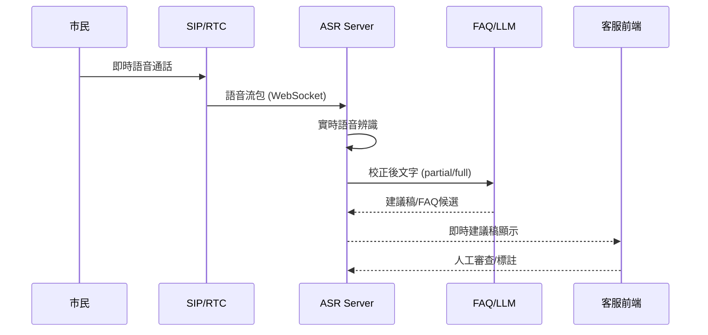

# 即時語音流智慧客服

## 1. **系統流程（即時語音流）**

```
[市民來電 → SIP/RTC 進線]
   ↓
[語音流接入（SIP Gateway/RTC SDK）]
   ↓
[即時 ASR（流式語音辨識）]
   ↓
[即時文字校正]
   ↓
[即時 FAQ 檢索+LLM 回覆建議]
   ↓
[客服介面同步顯示建議稿]
   ↓
[人工回覆、存檔、資料規範清理]
```

---

## 2. **架構圖（即時版）**

```
                ┌───────────────────────────────┐
                │        前端客服介面           │
                │   (WebSocket接收即時建議稿)   │
                └─────────────┬─────────────────┘
                              │
                ┌─────────────┴─────────────┐
                │     WebSocket API Gateway │
                └───────┬──────────┬────────┘
                        │          │
   ┌─────────────┬───────┘      ┌──┴──────────┐
   │語音流入接收  │             │ FAQ/LLM 檢索 │
   │(SIP/RTC)    │             │   (即時)     │
   └─────┬───────┘             └──┬──────────┘
         │                         │
 ┌───────┴─────────────┐    ┌──────┴─────────────┐
 │   流式ASR（國/台/客） │    │ FAQ知識庫/Embedding │
 └───────────────┬─────┘    └────────────────────┘
                 │
         ┌───────┴─────────────┐
         │ 即時文字校正/摘要生成│
         └─────────────────────┘

     ▼（全程即時/串流，資料依規範存檔與自動刪除）
```

---

## 3. **API 設計建議（WebSocket/gRPC流式）**

### (1) 語音流串流 (WebSocket/gRPC)

* 客戶端（如客服席/前端）與後端建立**WebSocket連線**。
* 客戶端每收到音訊包（ex: PCM/Opus/Raw），即推送給後端 ASR。

#### 3.1 語音流（WebSocket）

**路徑：**

```
ws://yourdomain.com/api/stream/asr
```

**流程範例：**

* 客戶端：`{"type": "start", "lang": "zh-TW", "case_id": "xxxx"}`
* 之後：連續推送語音包（byte流）
* 伺服器持續回送：`{"type": "partial", "text": "...", "confidence": 0.95}`
* 結束時：`{"type": "end"}`

#### 3.2 FAQ檢索/建議稿即時推送

* 每當收到新 ASR partial/full transcript，後端立刻呼叫 FAQ/LLM 檢索，產生建議稿，**通過 WebSocket** 實時推送到前端

**WebSocket 傳回：**

```json
{
  "type": "suggestion",
  "corrected_text": "已校正文字",
  "faq_candidates": [
    { "faq_id": 1, "question": "...", "answer": "...", "score": 0.92 }
  ],
  "reply_script": "您好，依照本府相關規定..."
}
```

#### 3.3 文字校正與 FAQ檢索同步進行

* ASR → 即時丟給文字校正API
* 校正後馬上進 FAQ/LLM 检索
* 整個過程「非阻塞、低延遲」串流

---

## 4. **舉例：即時客服席顯示流程**

1. 客服與市民通話進行中，語音流**即時送到ASR**，一邊聽一邊文字化
2. 每 1-2 秒自動「補字、修字」並顯示在客服席前端
3. FAQ/LLM**隨時回推新的建議稿**，客服可點選、複製、調整
4. 通話結束後，整段錄音＋文本＋FAQ參考記錄，依規範存檔

---

## 5. **技術方案建議**

* **語音流式ASR**：

  * Google Speech-to-Text Streaming API
  * Whisper Streaming
  * 本地化流式模型如 WishTalk、CNSMT (若台語/客語要求很高)
* **流式管線**：WebSocket 或 gRPC 雙向流
* **前端**：React/Vue 搭配 WebSocket，即時同步客服席
* **FAQ/LLM**：RAG 檢索服務做成微服務，支援低延遲查詢
* **通訊錄音儲存**：依規範分段存，提供異步下載與查詢
* **監控與異常告警**：流式服務必須加強健康檢查與延遲追蹤

---

## 6. **API/通訊時序圖（文字說明）**

```plaintext
[市民通話]
    │
    ▼
[SIP Gateway / RTC SDK]
    │  (PCM/Opus音訊片段)
    ▼
[WebSocket ASR Server] <---WS---> [客服席前端]
    │
    ▼
[ASR流式辨識 & 校正]
    │
    ▼
[FAQ/LLM即時檢索]
    │
    ▼
[建議稿回推客服席]
```

---

## 7. **補充（Mermaid 時序圖）**



---

## 8. **即時流式專用API設計（重點摘要）**

* **WebSocket `/api/stream/asr`**

  * 送：開始、語音包、結束
  * 收：partial transcript、校正文、建議稿、FAQ候選

* **POST `/api/case/record`**

  * 存檔（音訊片段、最終文字、FAQ建議、客服標註）

* **GET `/api/faq/query`**

  * 查詢 FAQ（for fallback 查詢/人工操作）

---

# 結論

* **流程全即時，重 WebSocket/gRPC、流式ASR與FAQ推播**。
* **客服介面同步出現語音辨識和建議稿，降低客服工作量與誤解**。
* **FAQ知識庫和流式語音模型都要支援高頻、低延遲**。


---
## 挑戰：
RAG遇到複雜情境、跨FAQ綜合、動態規則（ex.「請問我這個案件流程走哪一步？」）效果有限。政府FAQ經常不斷增修、標準答案有法律/政策變動，知識庫維護很重。

## 進階方案：
FAQ分級： 熱門（RAG解）、冷門（轉人工）+ 複雜查規則。

LLM + 工作流整合： 讓LLM「學會」如何查詢規則、流程（類 Agent 或 Tool-Calling）

## 微調/定製 LLM：

用「市府客服歷史問答」微調 LLM提升口吻/本地用語/流程解釋能力。但成本高（自有數據、資安、定期retrain），且LLM要能多語混雜對話才符合台灣場景。


---
完全同意！
在台灣公部門場景下，**微調專用機**其實是**必須的標配**，尤其是：

* 政府FAQ與流程常態性「微幅修正」（甚至每日熱更新）
* 在地用語、地方語音資料持續收集累積（台語/客語新詞、特殊稱呼）
* 法令政策微調直接影響客服回覆標準答案，**模型需定期增量微調（Fine-tune）以維持回覆正確性與本地化**

---

# 微調專用機 —— 必須配備與規劃

## 1. **硬體建議規格**

| 項目    | 配置建議                     | 補充說明                |
| ----- | ------------------------ | ------------------- |
| GPU   | 4 × NVIDIA A100 / L40S   | 可同時訓練ASR、LLM，效能與容量佳 |
| CPU   | 64 核心（如Xeon/EPYC）        | 支援多進程分佈式訓練          |
| RAM   | 512 GB 以上                | 處理大語料及分佈式訓練需求       |
| 儲存    | NVMe SSD 8TB 以上（RAID 10） | 高IO需求，存取訓練語料與模型快照   |
| 網路    | 10G 光纖（內部）               | 模型同步、備份、分佈式訓練       |
| 冗餘/備援 | 雙電源、硬體RAID、UPS           | 高可用防故障              |

> **可以規劃兩台，一主一備或分群：一台ASR微調專用，一台LLM/FAQ微調專用，或合併彈性調度。**

---

## 2. **部署/運維要點**

* **GPU資源統一由Kubernetes/Slurm等排程管理**，可即時切換專案與模型任務
* **支援ASR（Whisper、Wav2Vec2等）與LLM（Qwen、Llama、OpenBMB等）雙棲任務**
* **多語料與最新FAQ自動每日同步至本地訓練環境**（API接現有知識庫，定時取資料）
* **訓練完即時同步推送至推理主機（Zero Downtime）**，部署滾動升級
* **自動備份：模型快照、訓練資料每日異地備份**，確保模型安全

---

## 3. **維運流程建議**

1. **每日/每週定時抽取最新FAQ、政策規章、客服問答語料**
2. **數據預處理 + 清洗（自動ETL流程）**
3. **一鍵發動微調訓練（自動調度，GPU資源分配）**
4. **訓練結束自動驗證、推送最新模型至服務集群**
5. **舊模型保留快照，可隨時回滾**
6. **全流程訓練、上線、測試與備份自動化監控，發報告給管理員**

---

## 4. **附加說明**

* **公部門資安規範：**

  * 微調機房需與推理服務分區隔離
  * 資料傳輸加密、異動有日誌
* **硬體擴充性：**

  * 若未來語音/FAQ量體再提升，機房可加掛GPU、RAM擴容
* **AI人員維運：**

  * 可支持自動微調、批次測試、A/B測試（新舊模型並跑）、以及異常自動回報

---

# 小結

* 微調專用機是**必須的常駐基礎設施**，不是「偶爾才用」。
* 需高規GPU、高IO儲存、RAM大、網路快，且有自動排程及異地備援
* **ASR+LLM都需定期微調、即時熱升級，保障政府服務與本地化語境的同步**

```
[客服自有系統] 
    ↓（API/WebSocket/安全通道）
[API Gateway/負載均衡]
    ↓
-----------------------------------------------------
|         K8s/容器平台 (私有雲/混合雲)              |
|---------------------------------------------------|
| [ASR服務GPU池] <-> [音訊存儲]                     |
| [RAG/FAQ檢索CPU/RAM] <-> [FAQ資料庫/向量庫]       |
| [LLM推理GPU池]                                    |
| [DB/日誌/稽核/案件儲存]                           |
| [微調訓練專用GPU]（有需要時才啟用）                |
|---------------------------------------------------|
      ↓（內部調度）         ↓（定期/排程）
[備份/異地冷備]            [自動清理/重建]

```


收到，你的重點是：

* **客服端已有自有系統**，無需重新佈建桌機
* **所有AI模組（ASR、LLM、RAG等）皆由後端伺服器或雲端處理**
* **ASR（語音辨識）核心需強化Whisper大型模型，並留彈性支援本地化/未來技術替換**
* **RAG只是其中一環，需預留LLM微調、流程規則查詢等進階需求**
* **需求高併發、未來可擴充、兼顧資安**

下面直接給你一份**現代化、彈性API化的AI客服核心硬體架構建議**，完全不碰客服端，只針對**雲端/機房後端**：

---

# 台北市府智慧客服 AI 後端硬體規劃

---

## 1. **系統總體原則**

* **所有語音、問答、資料處理皆於雲端/機房完成**
* **客服系統僅透過API（REST/WebSocket/gRPC）介接**
* **所有AI引擎、知識庫、錄音存儲、權限控管皆後端統一管理**
* **彈性、可擴充（如Kubernetes）、模組化（每一AI服務都可獨立升級/更換）**
* **強調GPU資源池化、資料加密與政府級備援**

---

## 2. **核心運算資源建議（後端）**

### **A. GPU運算伺服器群（AI引擎池）**

| 模組         | 用途               | 規格建議                                 | 台數/數量      |
| ---------- | ---------------- | ------------------------------------ | ---------- |
| ASR引擎      | Whisper大型（多語微調）  | 2×NVIDIA A10或A100、CPU 32核、RAM 128GB  | 2-3台（冗餘）   |
| LLM推理      | LLM大模型 | 2×NVIDIA A100或L40S、CPU 32核、RAM 256GB | 2-4台（可彈性擴） |
| FAQ檢索（RAG） | 向量資料庫、嵌入查詢       | CPU 16核、RAM 128GB、SSD NVMe 2TB       | 1-2台       |
| 微調專用機      | Whisper/LLM本地再訓練 | 4×A100或L40S、CPU 64核、RAM 512GB        | 1台    |

> **註**：ASR/LLM推理通常可共用GPU池，但分流更易於擴充與維運。向量查詢（Milvus/Faiss/PGvector）可用高RAM多核機即可。

---

### **B. 音訊/資料存儲與安全管理**

| 模組      | 用途         | 規格建議                          | 台數/數量 |
| ------- | ---------- | ----------------------------- | ----- |
| 音訊儲存    | 通話錄音、轉錄備份  | 企業級NAS/RAID10、SSD 20TB+       | 2台冗餘  |
| 文本與案件   | 案件資料、FAQ管理 | PostgreSQL/MySQL雙節點、SSD RAID1 | 2台    |
| 備份/異地備援 | 災難復原       | 雲端/機房冷備份各1套                   | 1套    |
| 稽核/日誌   | 操作/異常紀錄    | ELK/Graylog伺服器、SSD 2TB        | 1台    |

---

### **C. 網路/資安/高可用**

* **負載均衡（Nginx、HAProxy）**：API及WebSocket流量分流
* **硬體防火牆/IDS/IPS**：依政府規範
* **VPN/零信任架構**：限制僅內部系統與授權對外API
* **全程SSL/TLS加密**：確保語音/文本傳輸安全
* **Kubernetes或容器平台**：微服務彈性擴容、滾動升級

---

### **D. 監控/管理/自動化**

* **Prometheus+Grafana**：GPU/CPU負載、API延遲即時監控
* **自動排程系統（Airflow/cron）**：資料自動刪除、FAQ定期重建、模型熱更換

---

## 3. **後端邏輯模組（硬體/資源掛載點）**

* **API Gateway/負載均衡** → (K8s Ingress/Nginx) →
  * **語音流服務（ASR）**（GPU池）
  * **RAG/FAQ服務**（向量庫CPU機）
  * **LLM推理（多語）**（GPU池）
  * **資料存儲、錄音存取**（NAS+DB）
  * **微調/訓練**（專用GPU機，有需求時才用）

---

## 4. **擴充性與未來proof**

* **所有ASR/LLM/RAG模組皆用容器化/Helm部署**，未來隨時可替換新版本
* **GPU池可擴充/熱插拔**，隨使用量彈性伸縮
* **FAQ知識庫、嵌入模型皆支援熱重建、無縫切換**
* **資安與合規自動監控、報表**

---

## 5. **簡化硬體拓撲圖（文字版）**

```
[客服自有系統] 
    ↓（API/WebSocket/安全通道）
[API Gateway/負載均衡]
    ↓
-----------------------------------------------------
|         K8s/容器平台 (私有雲/混合雲)              |
|---------------------------------------------------|
| [ASR服務GPU池] <-> [音訊存儲]                     |
| [RAG/FAQ檢索CPU/RAM] <-> [FAQ資料庫/向量庫]       |
| [LLM推理GPU池]                                    |
| [DB/日誌/稽核/案件儲存]                           |
| [微調訓練專用GPU]（有需要時才啟用）                |
|---------------------------------------------------|
      ↓（內部調度）         ↓（定期/排程）
[備份/異地冷備]            [自動清理/重建]
```

---

## 6. **小結**

* 客服端零投入，僅API介接
* 後端主力為GPU池（Whisper/LLM/微調）、CPU大機（FAQ/RAG/存取），資料NAS+DB高可用
* 模組化、彈性可擴展、資安強化
* 未來ASR/LLM隨技術升級可快速替換

---
